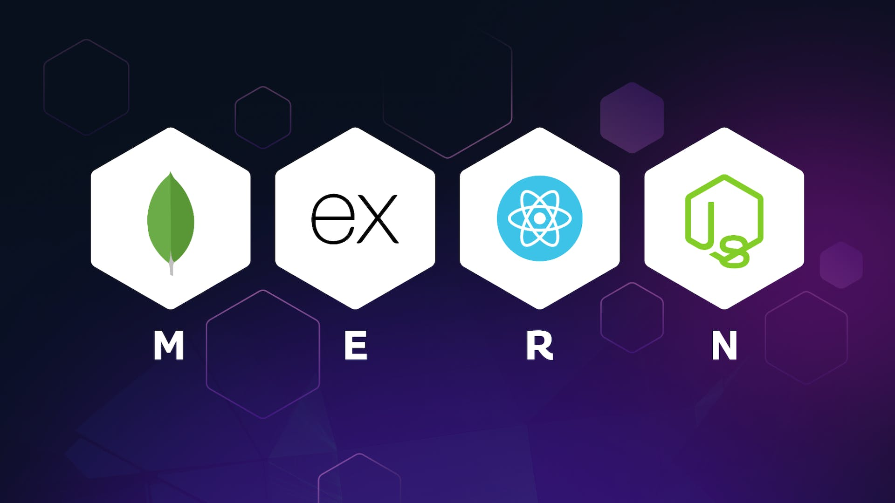

<h1 align="center" >Cureit Health Association</h1>

<b>Cureit Health Association</b> is a demo web application for an Non Governmental Health Organisation that aims to help the people for their health. 

<h2>Tech Stack </h2>
<b>The framework ,libraries and database used in the project are: </b>
<ul>
    <li><a href="react.dev" target="_blank">React Js</a></li>
    <li><a href="https://nodejs.org/en" target="_blank">Node Js</a></li>
    <li><a href="https://expressjs.com/" target="_blank">Express Js</a></li>
    <li><a href="https://mongodb.com/" target="_blank">MongoDB</a></li>
    <li><a href="https://bulma.io/" target="_blank">Bulma CSS</a></li>
    <li><a href="https://mongoosejs.com/" target="_blank">Mongoose</a></li>
    <li><a href="https://www.npmjs.com/" target="_blank" width="60%">Some packages like cors,express-validation,axios,top-toading-bar are used using npm package manager</a></li>
    <li><a href="react.dev" target="_blank">React Js</a></li>
    <li><a href="react.dev" target="_blank">React Js</a></li>
    <li><a href="react.dev" target="_blank">React Js</a></li>
    <li><a href="react.dev" target="_blank">React Js</a></li>
    <li><a href="react.dev" target="_blank">React Js</a></li>
    <li><a href="react.dev" target="_blank">React Js</a></li>

</ul>
<h2>Features </h2>
<b> Some of the Features of the Web Application:</b>
<ul align="left">
    <li>The styling is done using the CSS framework Bulma</li>
    <li>It's different pages are being routed by React BrowserRouter</li>
    <li>It uses axios to fetch and post data in the database</li>
    <li>News Api is being used to fetch current and latest health news </li>
    <li>Different forms are being used for careers, appointments, checkups, reports, donations.<li>
    <li>Font Awsome icons are used for attractiveness</li>

</ul>

